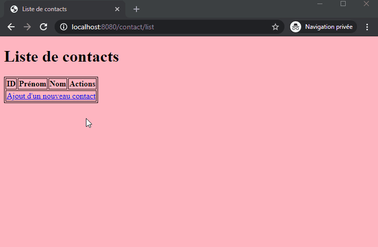

## Projet - Liste de contact
### Domitille POTTIER

---

---
API :

- **contact/put** :
Permet d'ajouter un contact à la BD (via formparams)

- **contact/delete?id=1** :
Supprime le contact dont l'ID est 1 en BD (via formparams)

- **contact/edit?id=1** :
Modifie le contact dont l'ID est 1 en BD (via formparams)

- **contact/list** :
Liste les contacts existant en BD

---
TODO List :

* Implémentation des adresses postales & mail - Débutée
* Authentification
* XML

